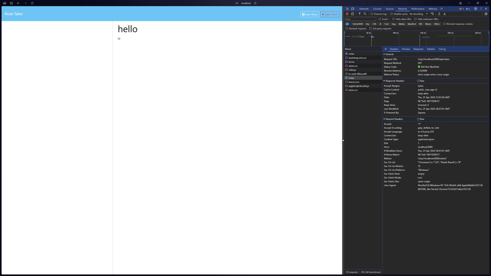

<!-- @format -->

# Note Taker

## Description

The Note Taker application is a web-based tool that allows users to create, save, view, and delete notes. It provides a simple and intuitive interface for managing notes efficiently. The application is built using Express.js for the back-end and HTML, CSS, and JavaScript for the front-end.

## Table of Contents

- [Description](#description)
- [Installation](#installation)
- [Usage](#usage)
- [Deployed Application](#deployed-application)
- [Screenshot](#screenshot)
- [License](#license)

## Installation

No installation required. You can access the application by clicking on the following link: [Note Taker](https://github.com/jakepears/notetakerapp)

## Usage

Use the Note Taker with the following steps:

1. Clone the repo.
2. Run `npm install`
3. Run `npm start` in the integrated terminal.

## Deployed Application

The deployed application can be accessed by clicking on the following link: [Note Taker](https://jakepears.github.io/notetakerapp/)

## Screenshot

## License

MIT License
